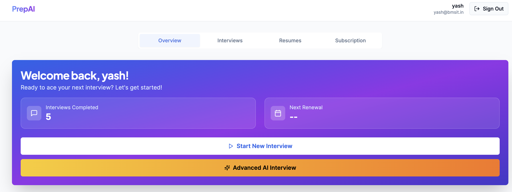
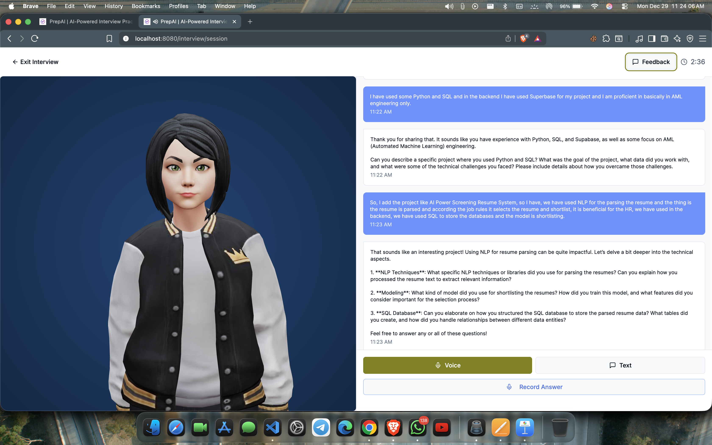
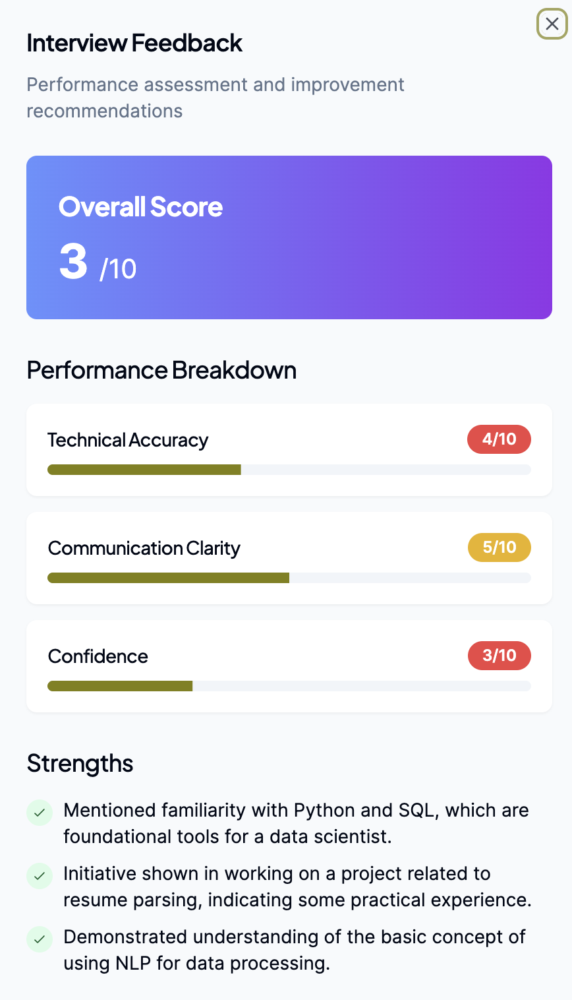
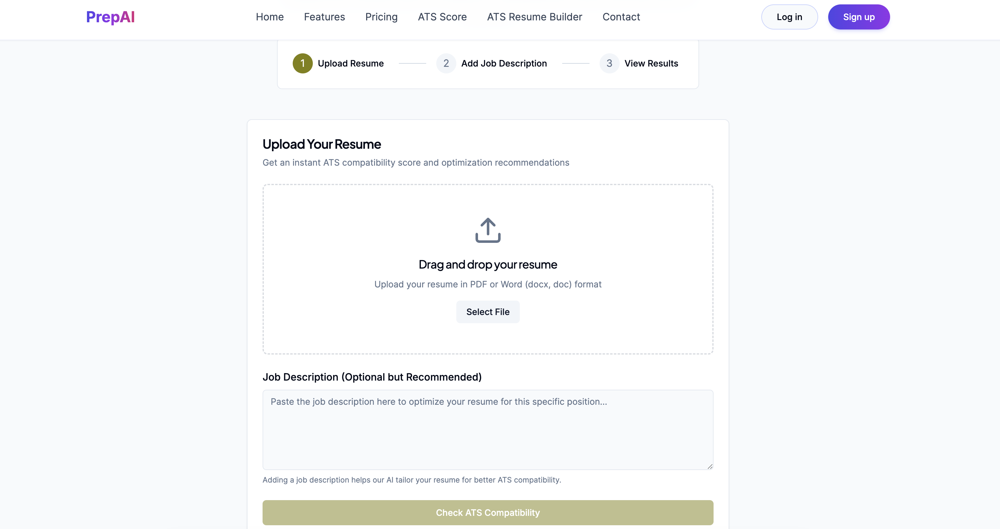

# AI Interview Coach

An AI-powered interview preparation platform that evaluates candidate responses and generates personalized feedback using Natural Language Processing and Machine Learning.

## Features

- Interview question generation
- Response analysis
- AI-based feedback generation
- Communication skill assessment
- Performance scoring
- Analytics dashboard

## Tech Stack

- Python
- Flask
- SQL
- NLP
- Machine Learning
- HTML/CSS
- JavaScript

## Workflow

1. User selects interview domain.
2. System presents interview questions.
3. Candidate submits responses.
4. NLP engine analyzes answers.
5. ML models generate scores and feedback.
6. Dashboard displays performance insights.

## Screenshots

## Screenshots

### Home Page

### Interview Interface

### Feedback Dashboard

# RESUME BASED QUESTIONS

## Future Improvements

- Voice-based interviews
- Real-time speech analysis
- LLM-powered feedback
- Personalized learning recommendations
